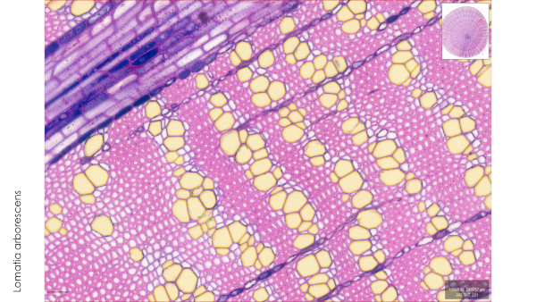
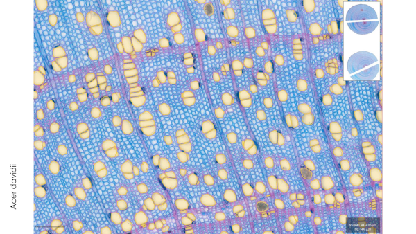
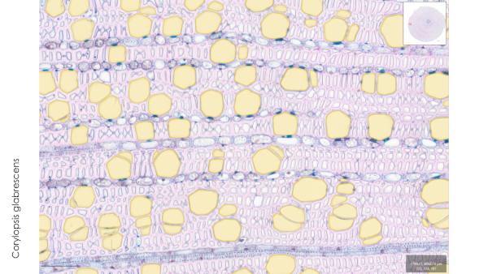

<p align="center">
  <a href="https://ai4life.eurobioimaging.eu/open-calls/">
    
  </a>
</p>

# Project #14: The speed of life in trees; Linking wood anatomy with wood lifespan and tree growth

In this project, scientist from the Hawkesbury Institute for the Environment, Western Sydney University wanted to investigate how wood anatomy is linked to wood lifespan and tree growth. There are four main cell types in wood: *Fiber*, *Vessel*, *Axial Parenchyma* and *Ray*. Each type of cell plays a different role in the transport of water and nutrients throughout the plant. By analyzing these cells, scientists hope to gain insights into how they affect wood lifespan and tree growth.  
The data for this project was aquired using brightfield microscopy (BFM) of cross-sections of wood samples, which allows researchers to capture images of the entire sample at once. This method provides high-resolution images that can be used to analyze individual cells within the wood structure. The data was included of 93 whole-slide images of 51 species.
<div>



</div>  

## Overview
To achieve the desired analysis of the project, as the first step we needed to apply a semantic segmentation model to segment the image into its respective cell types. But the provided data contained ground truth masks only for *Vessel* cells. Therefore, we provided two different approaches to solve this problem:
- For *Vessel* cells, we trained a deep learning model to achieve the segmentation masks.
- For other cell types (*Fiber*, *Axial Parenchyma* and *Ray*), we created a pipeline using [**FeatureForest**](https://github.com/juglab/featureforest), a napari plugin that uses a few user-provided scribble labels to generate semantic segmentation masks of desired cell types.


## Installation
First you need to install [conda] or [mamba] as your python package and dependency manager.  
We provided `install.sh` script for Linux & Mac OS users, and `install.bat` script for Windows users.  
First you need to clone the repo:
```bash
git clone https://github.com/ai4life-opencalls/oc_3_projec_14
cd ./oc_3_projec_14
```
Now run the installation script:
```bash
# Linux or Mac OS
sh ./install.sh
```
```bash
# Windows
./install.bat
```
This will install all required packages and dependencies including *napari* and the **FeatureForest** plugin. For more details about installation you can refer to the [installation page](https://juglab.github.io/featureforest/install/) of the **FeatureForest** plugin.

## Running *`marimo`* notebooks:
For various steps we provided a [`marimo`](https://marimo.io/) notebook which allows users to have a more interactive interface to run python codes. So, unlike usual *jupyter* notebooks, the user has no need to edit codes or enters parameters or paths manually.  

A `marimo` notebook is basically a script file that can be executed either by `python` or `marimo` command.  
> *marimo is an open-source reactive Python notebook: run a cell or interact with a UI element, and marimo automatically runs dependent cells (or marks them as stale), keeping code and outputs consistent and preventing bugs before they happen. Every marimo notebook is stored as pure Python (Git-friendly), executable as a script, and deployable as an app; while stored as Python, marimo notebooks also have native support for SQL*.

To run a notebook interactively, you need to run it using `marimo` command:
```bash
marimo run <notebook_file.py>
```
This will pop-up a new browser window (tab) where you can interactively execute the cells of the notebook.  
If you want to have more control over the notebook execution process, and being able to edit the codes, you need to run it in *edit* mode:
```bash
marimo edit <notebook_file.py>
```
To exit the interactive session, press `Ctrl+C` in the console terminal or use the *shutdown* button in the marimo browser tab.  
Here you can find more tutorials on how to work with `marimo`: https://docs.marimo.io/getting_started/


## Semantic Segmentation of *Vessel* Cells
This pipeline was made for the training of a semantic segmentation model to predict the mask of *Vessel* cells. You can find the detailed instructions on how to train the model and predict the masks in [here](vessel_segmentation/README.md)


## Generating masks for other cell types using FeatureForest
You can find the detailed instructions on how to prepare the data and use **FeatureForest** in [here](featureforest/README.md). 

---

<div style="text-align: justify">AI4Life has received funding from the European Union's Horizon Europe research and innovation programme under grant agreement number 101057970. Views and opinions expressed are however those of the author(s) only and do not necessarily reflect those of the European Union or the European Research Council Executive Agency. Neither the European Union nor the granting authority can be held responsible for them.</div>


[conda]: https://conda.io/projects/conda/en/latest/index.html
[mamba]: https://mamba.readthedocs.io/en/latest/installation/mamba-installation.html