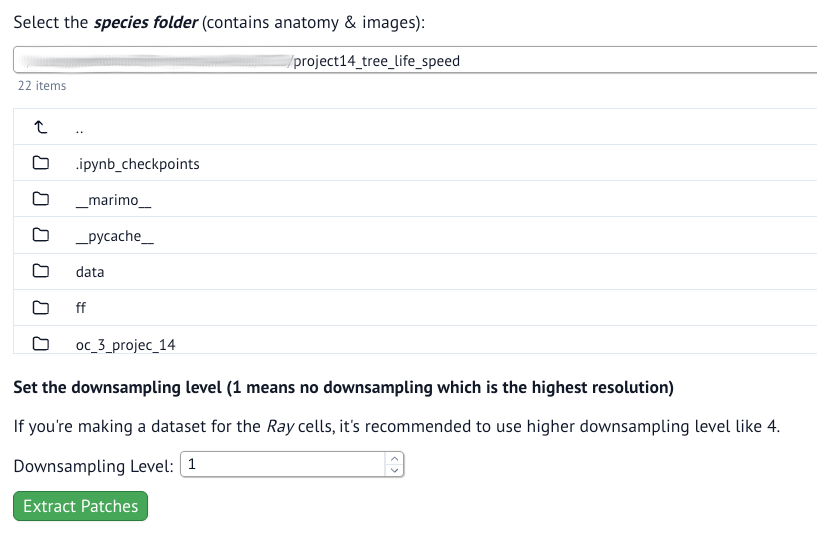
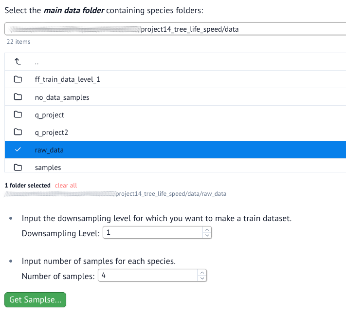
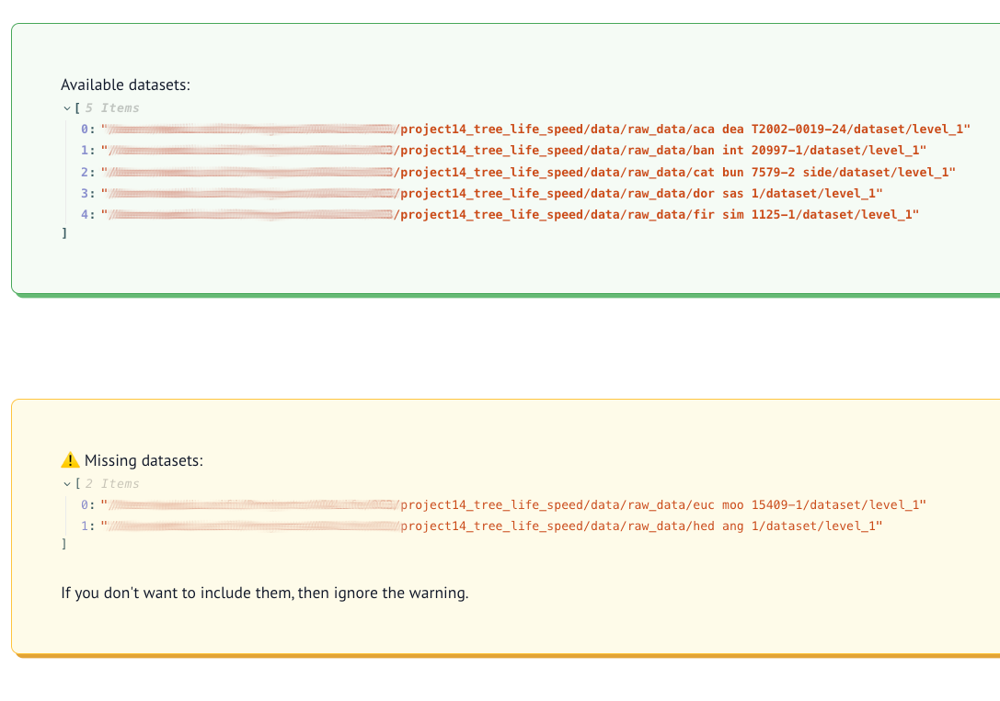
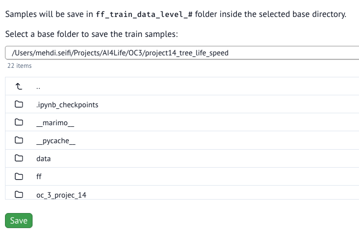
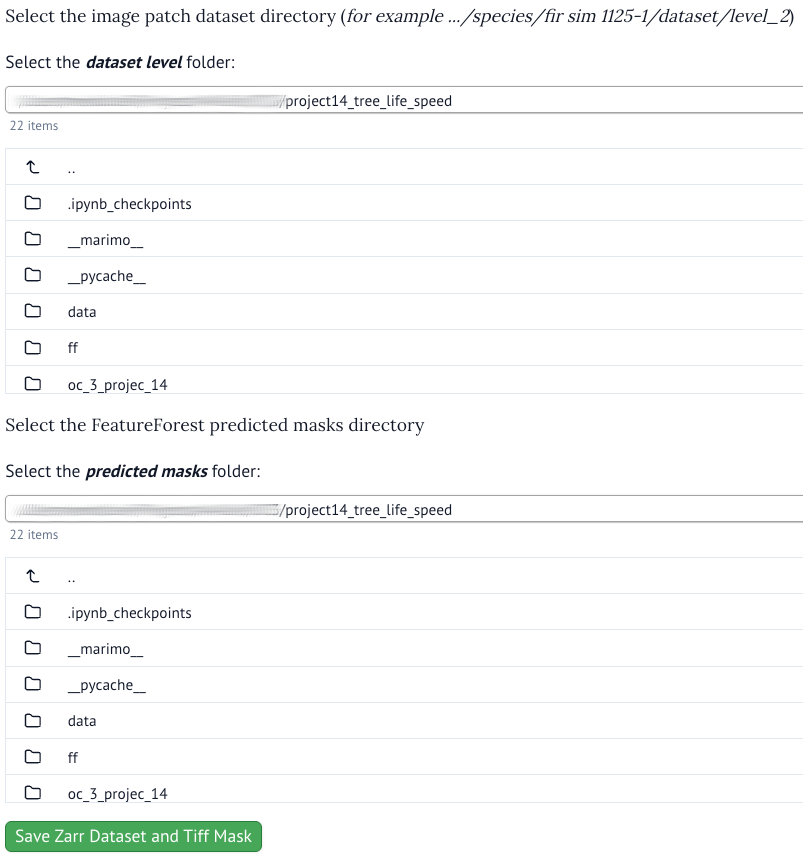

# Pipeline Description
This document will describe the pipeline used to prepare the data and train a *Random Forest* model utilizing **FeatureForest** napari plugin to generate segmentation masks.  

> [Note]
> Remember to activate the environment before running any commands.
> Like: `conda activate tree`

## Pipeline Steps

### Step 1: Data Preparation
The first step is to prepare the data for training and prediction. The raw data come with a very high-resolution whole-slide image in *Mirax* format. We need to extract image patches from the whole-slide images to create an image dataset.  
For this step you can use the `species_dataset.py` notebook. To run the notebook, issue this command in the same directory:
```bash
marimo run species_dataset.py
```
  

<br>

- **Downsampling Level**:  
The whole-slide image has **9** levels of resolution. With setting the downsamping level to **1**, you get the highest resolution patches.  
However, for the *Ray* cell segmentation, it is recommended to use more downsampling level because *Ray* cells are long cells in parallel to the sample cross-section. In higher resolutions, only part of those cells are visible, and this makes it hard for detection and segmentation of those cells.  

> [!NOTE]  
> The extracted patches will be saved in the selected species directory under `<species>/dataset/level_<n>`.  
> By default, the patches will be extracted only from the down-left quarter of the slide.  

> [!TIP]
> You can train a single model for several species. To do that, first you need to extract patches for all species one by one. Then in the next step, you can make a train stack containing patches from different species. 


### Step 2: Make A Train Stack
After extracting the patches, we need to select some of these patches randomly to form a training stack. This step is done by running the `make_train_data.py` notebook. You can run it like this:
```bash
marimo run make_train_data.py
```

  

<br>

In this notebook, first you need to select the main directory contains all species directories. Then you can specify the downsampling level and number of patch samples per each species. For example if you have 5 species and set the number of samples to 5, you get a training stack of 25 patches.
> [!TIP]
> It is recommended not to use too many samples or too many species for training. You may end up having a large training stack which takes longer time to train.  

  

*This shows a list of available datasets and those that are missing.*

<br>

  

*Finally, you can set a directory to save your training stack.*  

### Step 3: FeatureForest
Now we are ready to fire up *napari* and use the **FeatureForest** plugin to train a *Random Forest* model. You can find the documentation of the plugin here: [FeatureForest Documentation](https://juglab.github.io/featureforest/feature_extractor/).  
> [!TIP]
> For extracting features, it is recommended to check the *No Patching* box and use `SAM2_Large` model.  

After training the model, you need to save it using the [*Save Model*](https://juglab.github.io/featureforest/segmentation/#training-the-rf-model) button.


### Step 4: Predictions
Once you trained and saved the model, you can use it to predict masks of all extracted patches. You can do this with the **FeatureForest** plugin using [*Run Prediction Pipeline*](https://juglab.github.io/featureforest/segmentation/#run-prediction-pipeline). But for a better performance, or to run the pipeline over an *HPC* server, we provided the `run_pipeline.py` script.  
The script receives some arguments including path to the model, input directory, output directory, etc. To generate the proper commandline arguments, you can use the `ff_get_run_cmd.py` notebook. Run it like this (loading might take a while):
```bash
marimo run ff_get_run_cmd.py
```
You need to select the image input directory which will be the directory contains extracted patches for a species. Also, you need to provide the path for results and the path to the saved *RF* model. At the end, you will get the command line needed to run the `run_pipeline.py` script. Copy paste it into your terminal and run it.
```bash
# for example
python run_pipeline.py --data="<selected dir>" --outdir="<selected dir>" --feat_model=SAM2_Large --no_patching --rf_model="<selected model>" --smoothing_iterations=25 --area_threshold=7 --post_sam
```
This process might take a while depending on the number of patches and the computational power of your machine. Once finished, you should see folders named `prediction`, `post_simple`, and `post_sam` created inside the output directory. The `post_sam` folder contains the final predicted masks using `SAM2` post-processing method.  


### Step 5: Make `Zarr` Dataset
The created dataset usually included numerous patches and it's not possible to merge them all together as a single image without crashing the memory. Therefore, we need to convert our dataset into a format that can handle multi-resolution images efficiently. One such format is called [*Zarr*](https://zarr.dev/).  
To make the zarr dataset, you can run and use the `make_zarr_dataset.py` notebook:
```bash
marimo run make_zarr_dataset.py
```
  

The image zarr dataset will be saved beside the original dataset directory. The whole image mask will be saved as a single `TIFF` image since it contains only one channel and usually has value of 0 and 1 (for a binary mask).  
To view the zarr dataset in *napari*, we need to use the [`napari-ome-zarr`](https://github.com/ome/napari-ome-zarr) plugin. This plugin should be installed already using the provided install script. In *napari*, use the menu File > Open Folder and select the `.zarr` directory. Once loaded, you can open the *mask* tiff file separately and overlay it onto the zarr dataset.  

