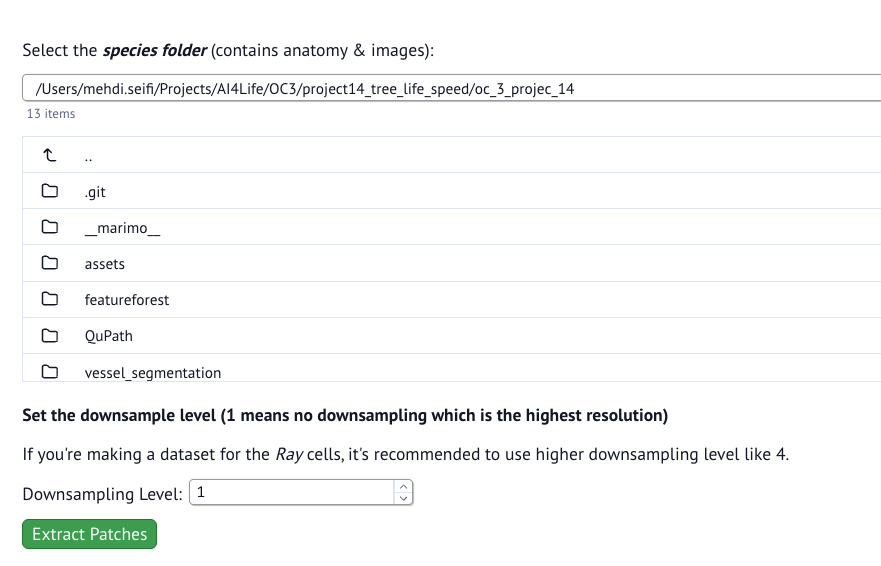

# Pipeline Description
This document will describe the pipeline used to prepare the data and train a *Random Forest* model utilizing **FeatureForest** napari plugin to generate segmentation masks.  
For various steps we provided a [`marimo`](https://marimo.io/) notebook which allows users to have a more interactive interface to run python codes. So, unlike usual *jupyter* notebooks, the user has no need to edit codes or enters parameters or paths manually.  

## Running *`marimo`* notebooks:
A `marimo` notebook is basically a script file that can be executed either by `python` or `marimo` command.  
> *marimo is an open-source reactive Python notebook: run a cell or interact with a UI element, and marimo automatically runs dependent cells (or marks them as stale), keeping code and outputs consistent and preventing bugs before they happen. Every marimo notebook is stored as pure Python (Git-friendly), executable as a script, and deployable as an app; while stored as Python, marimo notebooks also have native support for SQL*.

To run a notebook interactively, you need to run it using `marimo` command:
```bash
marimo run <notebook_file.py>
```
This will pop-up a new browser window (tab) where you can interactively execute the cells of the notebook.  
If you want to have more control over the notebook execution process, and being able to edit the codes, you need to run it in *edit* mode:
```bash
marimo edit <notebook_file.py>
```
To exit the interactive session, press `Ctrl+C` in the console terminal or use the *shutdown* button in the marimo browser tab.  
Here you can find more tutorials on how to work with `marimo`: https://docs.marimo.io/getting_started/

## Pipeline Steps

### Step 1: Data Preparation
The first step is to prepare the data for training and prediction. The raw data come with a very high-resolution whole-slide image in *Mirax* format. We need to extract image patches from the whole-slide images to create an image dataset.  
For this step you can use the `species_dataset.py` notebook. To run the notebook, issue this command in the same directory:
```bash
marimo run species_dataset.py
```
  

<br>

- **Downsampling Level**:  
The whole-slide image has **9** levels of resolution. With setting the downsamping level to **1**, you get the highest resolution patches.  
However, for the *Ray* cell segmentation, it is recommended to use more downsampling level because *Ray* cells are long cells in parallel to the sample cross-section. In higher resolutions, only part of those cells are visible, and this makes it hard for detection and segmentation of those cells.  

> [!NOTE]  
> The extracted patches will be saved in the selected species directory under `<species>/dataset/level_<n>`. 
