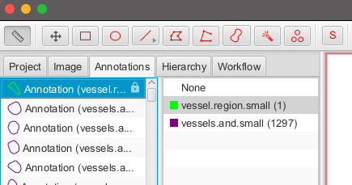

# Pipeline Description
Here we describe the pipeline for the segmentation of the *Vessel* cells. This includes the data preparation steps, and training/testing of the model.

## Pipeline Steps

### Step 1: Exporting Tiles
First we need to make a dataset from the annotated part of the whole-slide images. Each provided image came with a *QuPath* project that contains annotations on the vessels in a pie-shaped region. We can export tiles (patches) and their labels (masks) using *QuPath* `TileExporter`.  

  

To export these tiles and their masks, please check the script and documentation at [here](../QuPath/README.md). The exported tiles will be saved as `.tif` files under `tiles` directory including `images` and `labels`.

### Step 2: Tile Filtering
Since the annotated regions are pie-shaped, some tiles at the edges may contain only partial annotation which means they might contain more *vessels* but without annotations. This will make it hard for model to distinguish between *vessels* and *non-vessels*. Therefore, we need to filter out those tiles before feeding them into the model.  

To do so, first we need to export the polygon area around each annotated pie area. In QuPath, select the *vessel.region.small* annotation and export the polygon as a `GeoJSON` file.




<br>

> [Note]
> Remember to activate the environment before running any commands.
> Like: `conda activate tree`

After that, you can run `get_tiles_within_region.py` notebook to do this filtering step:
```bash
marimo run get_tiles_within_region.py
```
In this notebook, you should specify the path to the extracted tile images directory, and the exported GeoJSON file.  
The filtered tiles will be saved in the `tiles_within_region` directory.

### Step 3: Making Train/Test Datasets
Next, we need to make a dataset collecting all filtered tiles across different species, and then we split the dataset into train/test datasets.
```bash
marimo run make_dataset.py
```


### Step 4: Training the Model
#### Model Architecture
The model we designed for this segmentation task has two main parts: Encoder and Decoder. For the encoder part we used the [*hiera transformr*](https://github.com/facebookresearch/hiera). In particular, we utilized the [*SAM2*](https://github.com/facebookresearch/sam2) image encoder loaded with the pretrained weights (SAM2 small version). The encoder part is fixed during the training process.  
The decoder part consists of several convolutional layers based on the U-Net architecture.  
You need to download the encoder weights from [here](https://drive.google.com/file/d/1iXzxcxCmeIKcuMB-_4mxxEPGdXAU4bPI/view?usp=sharing) and save it in the same directory where `train.py` resides.

#### Training
You can train the model using the following command:
```bash
python train.py --dataset=./data/vessel_dataset/train
```
You need to provide the path to your train dataset directory that you made in the previous step (like *./data/vessel_dataset/train*).  
Also, you can change the `batch_size`, which is set to `16` by default. This value depends on how much GPU memory you have available. 
```bash
python train.py --dataset=./data/vessel_dataset/train --bsize=32
```
During the training process, you can monitor the loss values. All the training logs and model checkpoints will be saved in the *`checkpoints`* folder.  


### Step 5: Predictions
Once the model is trained, you can use it to predict the segmentation mask for the test dataset or new images (tiles). To do so, you can run the following command:
```bash
python predict.py --dataset=./data/vessel_dataset/test --model_path=./checkpoints/<your_experiment_folder>/model_best.pth
```
What you need to provide here is the path to your test dataset directory and the path to the best checkpoint of your experiment.  
This will generate predicted masks for each tile in the test dataset. You can find the predictions in the `predictions_{model.name}` directory.  

To have a prediction mask over a large area of the whole slide image, you can use the `featureforest/species_dataset.py` notebook mentioned [here](../featureforest/README.md#step-1-data-preparation). After the prediction, you can use the `featureforest/make_zarr_dataset.py` notebook to create a zarr dataset containing the large image and a single `tiff` file containing the predicted mask (see [here](../featureforest/README.md#step-5-make-zarr-dataset)).  
